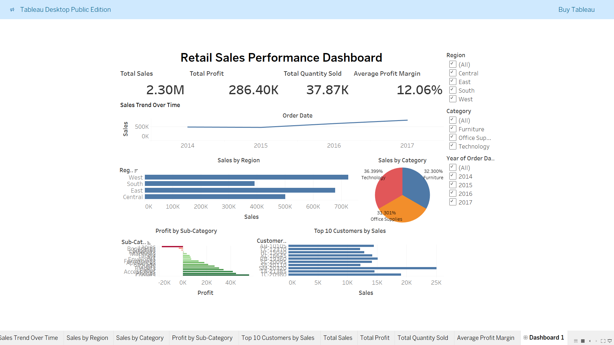

---

## Dashboard Preview

---

## Dashboard Demo

---

## Interactive Dashboard
View the full interactive dashboard on Tableau Public:

**Tableau Public Link:**  
https://public.tableau.com/views/RetailSalesPerformanceDashboard_17729524631410/Dashboard1?:language=en-US&:sid=&:redirect=auth&:display_count=n&:origin=viz_share_link

---

## Project Objective
The objective of this project is to demonstrate practical skills in:

- Data cleaning
- KPI creation
- Business data analysis
- Interactive dashboard development

This project simulates how business teams monitor **sales performance, profitability, and customer contribution** through data visualization tools.

---

## Author
**Praveen**

Aspiring **Data Analyst** focused on building projects using **Excel, SQL, Tableau, and Python**.
